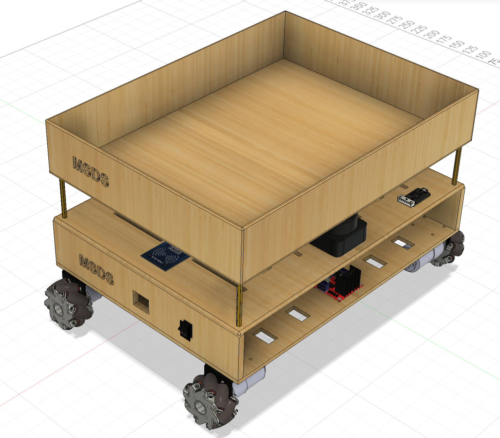

## MSDS (Medical Supply Delivery System) ROS Workspace 

### Description
This is a ROS workspace for the MSDS (Medical Supply Delivery System) project. The project aims to develop an autonomous delivery system for medical supplies using a robot equipped with a Mecanum wheel drive system.
The robot is designed to navigate through hospital environments, delivering supplies to various locations while avoiding obstacles and ensuring safety.



### Properties
- **Robot Type**: Mecanum Wheel Drive
- **Robot Dimensions**: 300mm x 400mm
- **Wheel Type**: Mecanum
- **Wheel Count**: 4
- **Wheel Diameter**: 97mm
- **Wheel Width**: 40mm
- **Wheel RPM**: 178
- **Max Linear Speed**: 0.9m/s
- **Max Angular Speed**: 2.58rad/s
- **Base Material**: Acrylic and Wood
- **Base Thickness**: 14mm
- **Wall Material**: Foam Board
- **Wall Thickness**: 10mm
- **Battery Type**: Li-ion
- **Battery Capacity**: 12V, 10Ah

### Features
- **ROS2**: The project is built on the Robot Operating System (ROS) 2, which provides a flexible framework for writing robot software.
- **Mecanum Wheel Drive**: The robot is equipped with a Mecanum wheel drive system, allowing for omnidirectional movement.
- **Obstacle Avoidance**: The system includes algorithms for obstacle detection and avoidance, ensuring safe navigation in dynamic environments.
- **Path Planning**: The robot can plan its path to the destination while avoiding obstacles and optimizing for efficiency.
- **Localization**: The robot uses various sensors to determine its position within the environment, enabling accurate navigation.
- **Mapping**: The system can create a map of the environment using sensor data, allowing for better navigation and obstacle avoidance.
- **SLAM**: The project implements Simultaneous Localization and Mapping (SLAM) techniques to build a map of the environment while keeping track of the robot's location.
- **Teleoperation**: The robot can be controlled remotely for manual operation and testing.
- **Visualization**: The system provides visualization tools for monitoring the robot's status, path, and environment.
<!-- - **Simulation**: The project includes a simulation environment for testing and validation of the robot's capabilities before deployment in real-world scenarios. -->

### Installation
1. **Clone the Repository**: 
   ```bash
   git clone https://github.com/Eyiza/msds_ws.git
   ```
2. **Navigate to the Workspace**:
   ```bash
   cd msds_ws
   ```
3. **Install Dependencies**:
   ```bash
   sudo rosdep init
   rosdep install --from-paths src --ignore-src -r -y
   ```
4. **Build the Workspace**:
   ```bash
   colcon build
   ```
5. **Source the Workspace**:
   ```bash
   source install/setup.bash
   ```
6. **Launch the Simulated or Real Robot**:<br>
   For the simulated robot:
   ```bash
   ros2 launch msds_bringup simulated_robot.launch.py
   ros2 launch msds_bringup simulated_robot.launch.py use_slam:=true 
   ros2 launch msds_bringup simulated_robot.launch.py world_name:=test
   ```
   For the real robot:
   ```bash
   ros2 launch msds_bringup real_robot.launch.py
   ros2 launch msds_bringup real_robot.launch.py use_slam:=true 
   ros2 launch msds_bringup real_robot.launch.py map_name:=test
   ```

### Related Projects
- [MSDS Web App](https://github.com/Eyiza/MSDS): A web interface for monitoring and controlling the MSDS robot.
- [MSDS CAD Design](https://a360.co/4b1KEEi): Fusion 360 design for the MSDS robot.

<!-- ### Contributing
Contributions are welcome! Please fork the repository and submit a pull request with your changes. Ensure that your code adheres to the project's coding standards and includes appropriate documentation. -->

### Contact
For any questions or issues, please open an issue on the GitHub repository or contact the project maintainer at [eyiza.mich@gmail.com](mailto:eyiza.mich@gmail.com)
